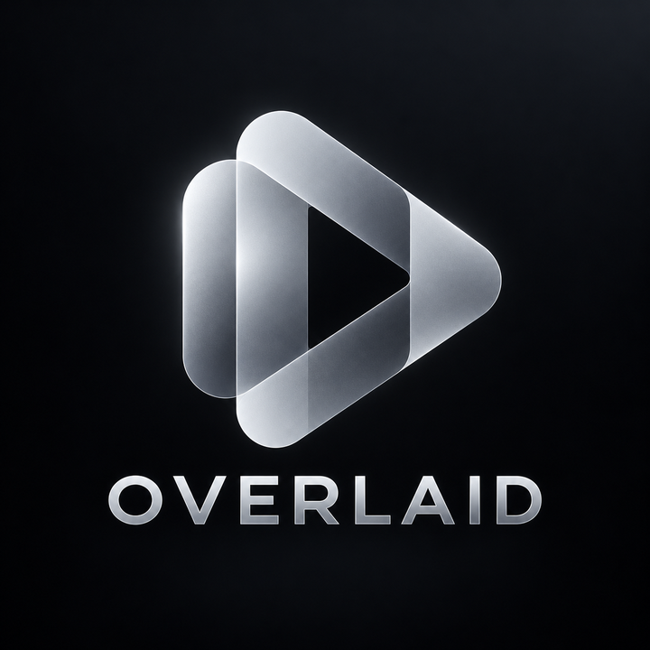

<p align="center">
  
</p>

<p align="center">
  A local video editor that runs in the browser.<br>
  Text on a screen recording, cropped, trimmed, sped up, exported.
</p>

<p align="center">
  <a href="https://github.com/Exyons/overlaid/releases"></a>
  
  
</p>

---

Overlaid was built for one job: tagging a project demo with a name, roll number
and department before handing it in. It has since grown into something worth
using for screen recordings generally.

Every preview you see is a real frame from the renderer, not an approximation of
one. The picture tells you which you are looking at.

## Contents

- [Requirements](#requirements)
- [Running it](#running-it)
- [The editor](#the-editor)
- [Previews you can trust](#previews-you-can-trust)
- [Export](#export)
- [Finding the crop](#finding-the-crop)
- [Command line](#command-line)
- [How it fits together](#how-it-fits-together)
- [Tests](#tests)

## Requirements

Python 3.12 or newer, [uv](https://docs.astral.sh/uv/), Node, and ffmpeg with
ffprobe. Everything runs on your machine. Nothing is uploaded anywhere.

## Running it

```bash
./run.sh build     # compile the frontend once
./run.sh serve     # http://127.0.0.1:8787
```

`./run.sh dev` runs FastAPI with reload on 8787 and Vite on 5173, proxying
`/api` across. Set `PORT` to move the backend.

Drop a video on the library page and open it.

## The editor

The right side has three tabs.

Effects holds the text blocks. Each one is listed by its first line so you can
pick it without hunting for it on the picture. Text is one group among several
rather than the whole tab, so other effects can join it later. Type into the
box, choose any font on the system, and drag the block where you want it.

The nine cell control snaps text to a part of the frame and anchors it there.
Anchoring is what keeps it stable: text grows inward from its anchor, so a
longer line cannot push itself off the edge. Drag it anywhere else and the
control reads "custom" instead of claiming a corner the text is no longer in.

Crop and size opens the crop tool. The picture switches to the whole uncropped
frame with a rectangle over it, because choosing a crop means looking at the
part you are about to throw away. Drag the rectangle or its handles, or pick a
shape (16:9, 1:1, 9:16 and so on) to constrain it. Letting go reshapes the
output to match, since cropping changes the shape of the picture and keeping the
old size would letterbox the new crop back into the frame it was cut from.

Trim handles sit on the scrubber. The bar always spans the whole source and the
excluded parts are dimmed rather than removed. Trimming is non destructive, so
the material outside the range still exists and stays reachable, which also
means you can check what is either side of a cut before committing to it.

Speed sits next to the trim controls, since both decide how long the export
runs. Speeding up resamples back to the source frame rate instead of leaving
twice as many frames per second: at 2x that would spend bitrate on motion nobody
can see. Audio is retimed to match.

| Key | Does |
|---|---|
| `Space` | play and pause |
| drag | move a text block |
| Left and Right | step one frame, hold Shift for ten |
| `Ctrl+Z`, `Ctrl+Shift+Z` | undo, redo |
| `Delete` | remove the selected text |
| `Esc` | deselect |

## Previews you can trust

Dragging something moves it on a canvas, which is instant but only an
approximation. When you stop, the editor asks the server for a real rendered
frame and swaps it in.

The matte around the picture and the readout by the transport say which one is
on screen: amber while it is the browser's guess, cyan once the renderer has
confirmed it. Both are built from the same filter chain as the export, so a
frame marked rendered is what the file will contain.

Preview requests carry the document the editor is holding rather than whatever
autosave last wrote, so the picture can never lag behind the controls.

## Export

Quality is a slider from 0 to 100, mapped into the usable part of each codec's
scale rather than the whole of it. 100 means visually lossless, which is H.264
CRF 16. It does not mean mathematically lossless: CRF 0 reproduces the source's
own compression artefacts exactly and measured 7.7 times the size of a 12 Mb/s
screen capture. The bottom of the slider stops where the picture is still worth
looking at.

A quality target on its own does not bound a file, so the bitrate is also capped
against the material. The cap comes from the source's own rate, scaled by how
much of its picture survives. Cropping and downscaling lower it proportionally.
Upscaling does not raise it, because more output pixels than the source holds
cannot mean more detail and so must not mean more bits. Two things had been
exploiting the absence of a cap, measured on a 12.3 Mb/s capture:

| | Bitrate |
|---|---|
| 3.5x upscale, libx264 | 20.4 Mb/s |
| native size, libx264 | 8.6 Mb/s |
| native size, NVENC | 19.4 Mb/s |
| the same three, capped | 4.5 to 5.2 Mb/s |

Hardware encoders were the worse offender. Given a quality target and no
ceiling, NVENC produced 2.4 times the size of libx264 at a matched setting. The
output sizes offered never exceed what the crop actually contains, for the same
reason.

MP4, WebM, GIF and MOV are available. GIF is capped to 15 fps and 800 pixels
wide and written in two passes, since a single pass GIF is stuck with a generic
palette and looks it.

### Hardware encoding

H.264 exports use the graphics chip when the machine has a usable one. Encoders
are found by probing, meaning a real one frame encode, rather than by reading
`ffmpeg -encoders`. That list says what the binary was built with, not what the
hardware will accept. A laptop with a switchable NVIDIA card advertises NVENC
and then fails at CUDA init; VAAPI will happily bind to a render node whose
driver cannot encode. Both were true on the machine this was built on. Anything
that fails its probe is never offered, and an encoder that stops working falls
back to libx264 rather than failing the export.

Measured on a 70 second 1856x1116 60fps capture:

| | Time | Size |
|---|---|---|
| Quick Sync, quality 75 | 21s | 55 MB |
| Quick Sync, quality 100 | 20s | 92 MB |
| libx264, quality 100 | 63s | 78 MB |

Hardware is several times faster. libx264 spends longer and fits more picture
into the same bitrate.

## Finding the crop

Crop and size has a "Detect content" button. A screen capture surrounds the part
worth keeping with things that never move: tabs, a URL bar, a settings panel.
How much each pixel varies over the recording separates the two without needing
to recognise any of it. The furniture scores near zero and the content does not.

It proposes rather than applies, and it says when it found nothing instead of
returning a confident rectangle around noise. On the recording it was built
against it lands within a few percent of a hand made crop, and additionally
keeps the app's own toolbar, whose readouts genuinely animate.

Frames come from short windows spread across the recording rather than from the
whole timeline. Decoding every frame to keep a few dozen was almost all of the
cost: 8.4s on a three minute capture against 1.7s for the same frames taken from
eight half second windows. Hardware decode was tried and is slower, not faster,
because the frames have to come back to system memory to be analysed either way.

## Command line

The original interface, still the fastest way to tag one file.

```bash
uv run python overlay.py INPUT.mp4 \
  --name "Your Name" \
  --roll "21BCE1234" \
  --dept "Computer Science & Engineering"
```

Writes `INPUT_tagged.mp4` beside the input unless `-o` says otherwise.

| Flag | Default | Notes |
|---|---|---|
| `--pos` | `bottom-right` | also `bottom-left`, `top-left`, `top-right` |
| `--size` | `3.0` | text height as a percentage of video height, so it scales with resolution |
| `--no-box` | off | drops the dark plate behind the text |
| `--font` | DejaVu Sans Bold | any TTF path |
| `--format` | `mp4` | `mp4`, `webm`, `gif`, `mov` |
| `--quality` | `75` | 0 to 100, mapped onto each codec's own scale |
| `--normalize` | off | letterbox to `1920x1080`, or pass `WxH` |
| `-o` | | output path |

`--normalize` exists because capture tools emit odd frame sizes. This was built
against an 1856x1116 OBS recording, and some upload portals reject anything non
standard. It scales to fit and pads the remainder black so the aspect ratio
survives instead of being squeezed. Text is drawn after the pad, so it never
lands in a bar.

## How it fits together

```
core/
  doc.py        the edit document: dataclasses, JSON, validation
  compile.py    EditDoc to ffmpeg argv. Pure: no subprocess, no I/O
  analyze.py    reads the footage and proposes edits (OpenCV)
  encoders.py   probes for a usable hardware encoder
  probe.py      ffprobe wrapper
  run.py        executes a compiled plan, reports progress
overlay.py      the CLI, a thin client of core/
api/
  main.py       routes
  db.py         sqlite3: projects and renders
  jobs.py       background render queue
web/            Vite, React, TypeScript
  src/
    Library.tsx    upload, project list
    Viewer.tsx     player, scrubber, proof state
    Canvas.tsx     overlay drawing, drag, hit testing
    CropBox.tsx    crop rectangle and handles
    TrimBar.tsx    scrubber with in and out points
    EffectsPanel.tsx, Inspector.tsx, FramePanel.tsx, Export.tsx
    layout.ts      canvas geometry, mirrors compile.py
    store.ts       edit document, undo and redo, autosave
data/           uploads, renders, sqlite (gitignored)
```

There is one renderer. `compile.py` turns an edit document into ffmpeg
arguments, and the CLI, the frame preview and the final export all call it, so
there is no second code path that could drift from the first. It is deliberately
pure: it takes a document and returns a plan, touching no process and no file.
That is what lets the whole filter chain be asserted as a string in a test, and
it is why the preview can be trusted rather than merely hoped for.

Geometry is stored normalised, never in pixels. Crop is a fraction of the
source; overlay position and font size are fractions of the output. Change the
export resolution and the layout rescales instead of breaking.

`web/src/layout.ts` mirrors `drawtext_filter()` in `core/compile.py` closely
enough to read as a translation of it. The canvas is sized to the output
resolution and scaled down with CSS, so both work in the same coordinate space
and a click lands on the pixel the renderer will draw. Where those two files
disagree, the preview lies.

### Two things that are easy to get wrong

Text reaches ffmpeg through a sidecar file rather than inline on the command
line. Inline text has to survive two layers of ffmpeg parsing, and no escaping
scheme handles apostrophes, `%` and backslashes together. All three turn up in
ordinary names and department strings.

Preview frames are PNG rather than JPEG. A JPEG decoder assumes BT.601 full
range whatever the file is tagged with, while this footage is BT.709 limited
range and the browser decodes the video element as such. The rendered frame and
the video it replaced therefore drew in visibly different colours, worst in
green, and every edit flashed between them. Measured against a direct
conversion, the mean per pixel error fell from 3.37 to 0.067 once the YCbCr
round trip was dropped. RGB has no matrix to disagree about. Library thumbnails
are scaled down before encoding, since a full size lossless frame for every row
would be several megabytes each.

## Tests

```bash
uv run pytest
```

136 tests. Most assert on compiled filter strings and need no ffmpeg at all,
which keeps them fast and hermetic. A smaller set renders a committed two second
fixture for real and probes the result, covering the things a string cannot:
that audio survives, that a trim shortens the file, that hostile text actually
encodes, that a noisy failure does not deadlock the reader.

Design notes are in `docs/superpowers/specs/2026-08-28-video-editor-design.md`.
